# Day 2 : Electric Potential and Voltage and Current and ohm's law

***

## Electric Potential

Imagine an electric field is like a **downhill slope**. Picture a tiny **positive test charge** (a conceptual tool we use for analysis). It naturally moves “down” the field.

If you push this charge **uphill**, against the field, you must provide **work (energy)** to do this. This energy is not lost; instead, it is stored as **electric potential energy**.

This means the charge now holds stored energy that can later be released when it moves with the field.

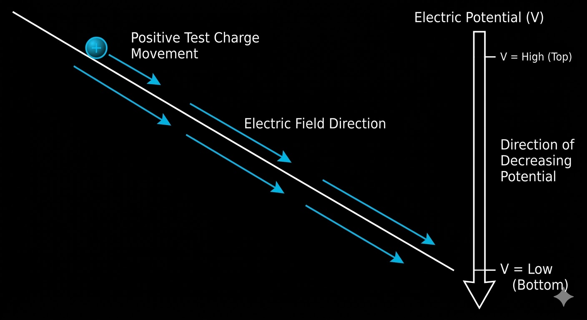

The **electric potential (V)** at a point is the amount of this energy **per unit charge**:

V = U / q

**Where:**
* **V** > electric potential (volts, V)
* **U** > electric potential energy (joules, J)
* **q** > charge (coulombs, C)

***

## Voltage (Potential Difference)

**Voltage** is the **difference in electric potential between two points**.

It tells us how much energy is transferred per unit charge when moving between those points:

V = V2 - V1

**Where:**
* **V** > voltage (volts, V)
* **V2** > potential at point 2
* **V1** > potential at point 1

Voltage is always relative to a reference point.

When we say a node in a circuit is **3.3 V**, we mean **3.3 V relative to ground (0 V)**.

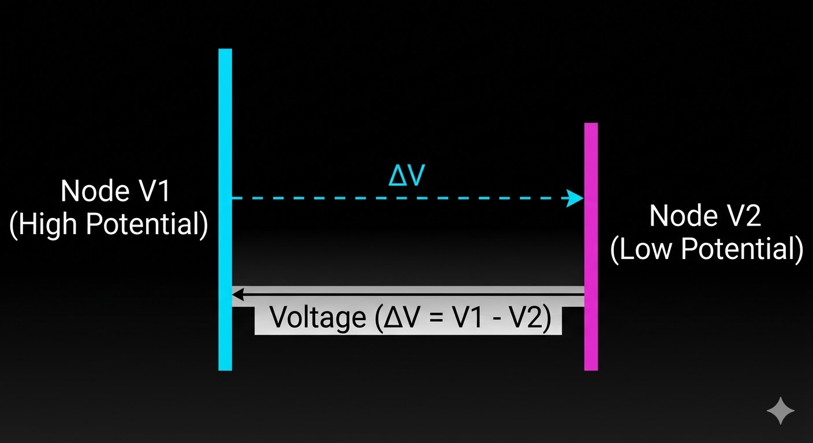

***

## Relationship Between Electric Field and Potential

The electric field describes how quickly potential changes in space:

E = - dV / dx

**Where:**
* **E** > electric field (V/m)
* **dV/dx** > rate of change of potential with distance

The electric field points in the direction where potential **decreases** fastest.

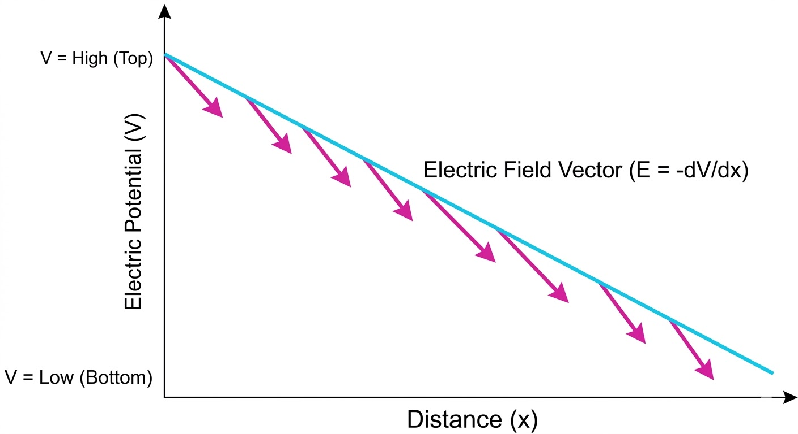

### Special Case: Parallel Plate Capacitor

In a case with a uniform field, like inside a capacitor, we calculate the magnitude of that field:

E = V / d

**Where:**
* **V** > voltage across the plates
* **d** > distance between plates

*Note: The negative sign is dropped here because we are focusing on the magnitude of the field, which is vital in engineering for defining dielectric limits.*

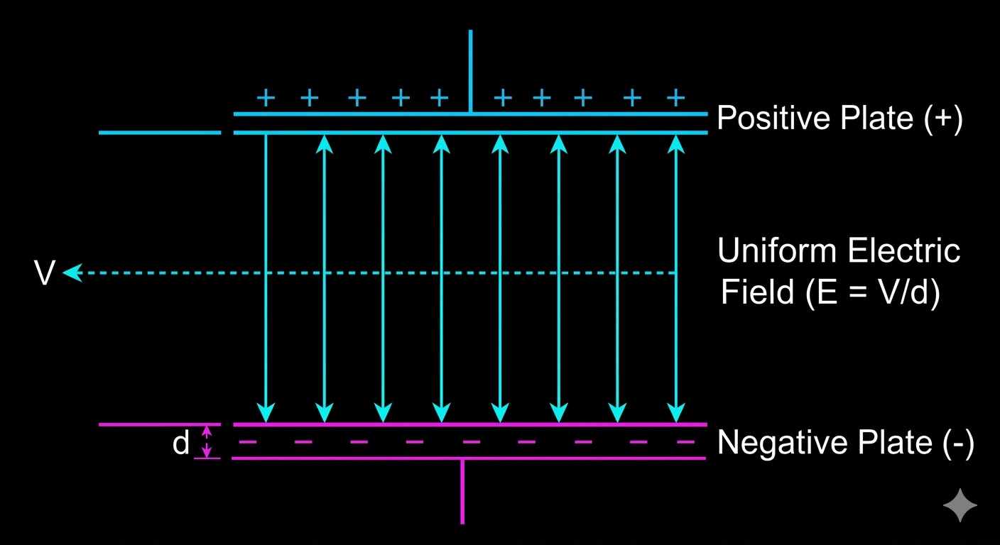

***

## Why Ground is Just a Reference

Ground is not necessarily a physical sink for charge.

It is a point in the circuit that we **choose (arbitrarily)** to define as **0 V**. All other voltages are then measured relative to it.

### In practice:
* **Earth ground** > physical connection to Earth (safety)
* **Circuit ground** > reference node (may float)
* **Chassis ground** > device enclosure

### In embedded systems:
* **AGND (Analog Ground)**
* **DGND (Digital Ground)**

These are separated to reduce noise, and then connected at a single **star point**.

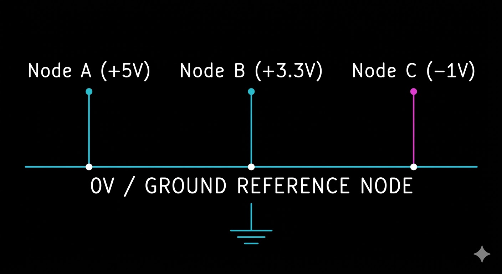

***

## Current: Charge in Motion

Current is the **rate at which charge flows**:

I = dq / dt

**Where:**
* **I** > current (amperes, A)
* **dq** > charge (coulombs, C)
* **dt** > time (seconds, s)

### Convention

* Conventional current flows from **positive to negative**
* Electrons move from **negative to positive**

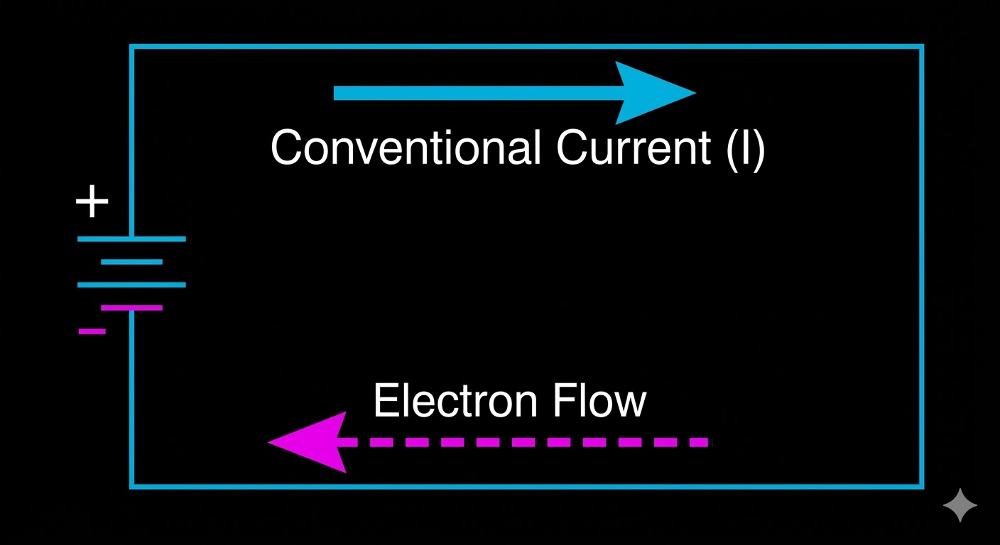

***

## Current Density (Practical Insight)

J = I / A

**Where:**
* **J** > current density (A/m2)
* **I** > current (A)
* **A** > cross-sectional area (m2)

This is important in PCB design when calculating the width of a trace based on current density to stay within thermal limits.

***

## Embedded Systems Connection

These concepts directly apply to real systems:

* An ADC (Analog-to-Digital Converter) measures a voltage relative to AGND (Analog Ground).
* A GPIO pin switches between voltage levels (0 V / 3.3 V).
* I2C and SPI signals are based on voltage logic levels.
* Power rails (3.3 V, 1.8 V, VDD) are all defined relative to ground.
* Capacitors store energy based on the voltage across them.
* MOSFETs control current flow using electric fields.

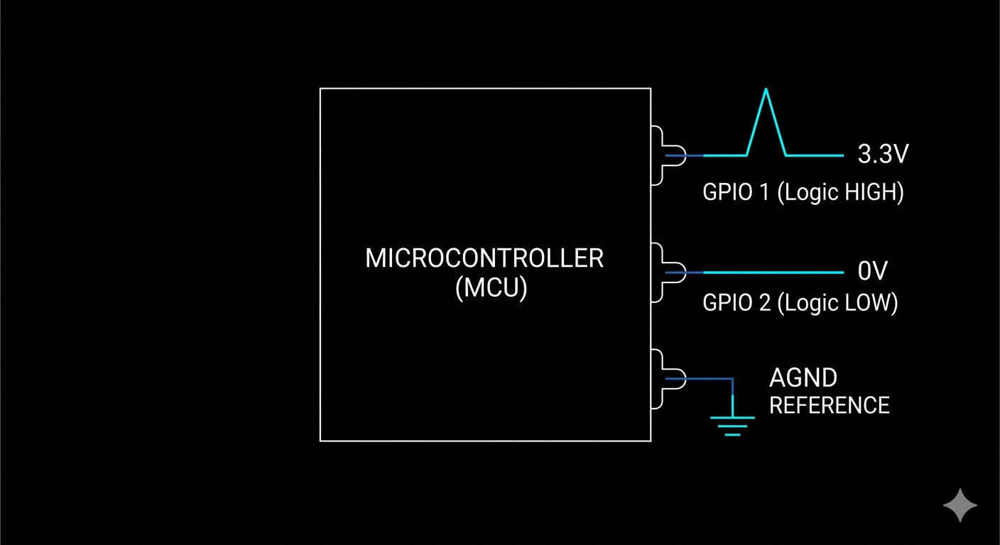

***

## Intuition: Why Voltage Matters

Voltage is what **drives current** through a circuit. Imagine it as a powerful "push."

Analogy:
* Voltage = pressure difference
* Current = flow

The higher the voltage, the stronger the push on charges, and the more current flows (if resistance is constant), according to Ohm’s Law:

V = I * R

**Where:**
* **V** > voltage (V)
* **I** > current (A)
* **R** > resistance (ohms)

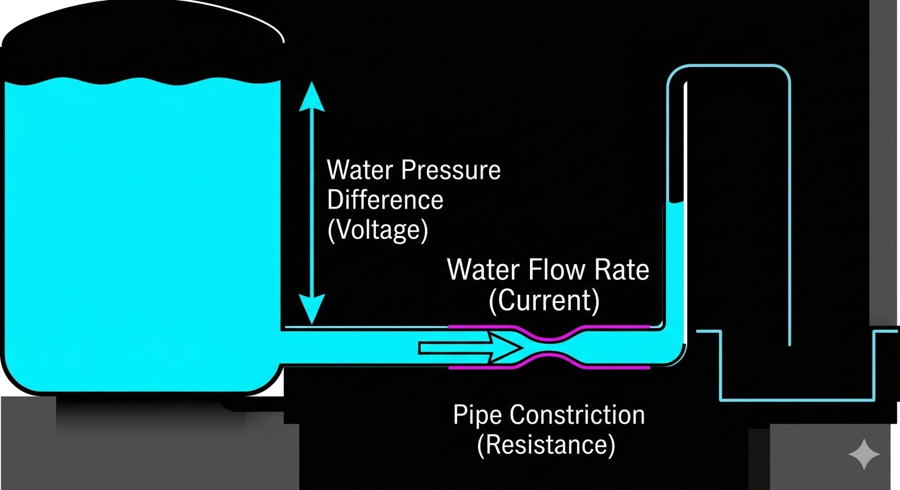

# Ohm's Law

***

## The Microscopic Picture: Drude Model

Most textbooks present Ohm's Law as a given: V = I * R. But to truly understand it and to know when it breaks down, you need the **microscopic** derivation.

In a conductor (like copper), free electrons are in constant random thermal motion, colliding with the crystal lattice roughly every 10^-14 seconds (a value known as the mean free time, represented by the Greek letter τ, tau). In the absence of an electric field, this motion is entirely random, meaning there is no net flow of charge—so, no current.

When an electric field (E) is applied (for example, by connecting a voltage source), each electron experiences a force:

F = q * E

**Where:**
* **F** > force on the electron (newtons, N)
* **q** > charge of the electron (coulombs, C)
* **E** > electric field (V/m)

*(Note: This force is mathematically negative because electrons are negatively charged, meaning they are pushed in the opposite direction of the electric field.)*

This force gives the electron an acceleration, according to Newton's second law (F = m * a):

a = (q * E) / m

**Where:**
* **a** > acceleration (m/s2)
* **m** > mass of the electron (kg)

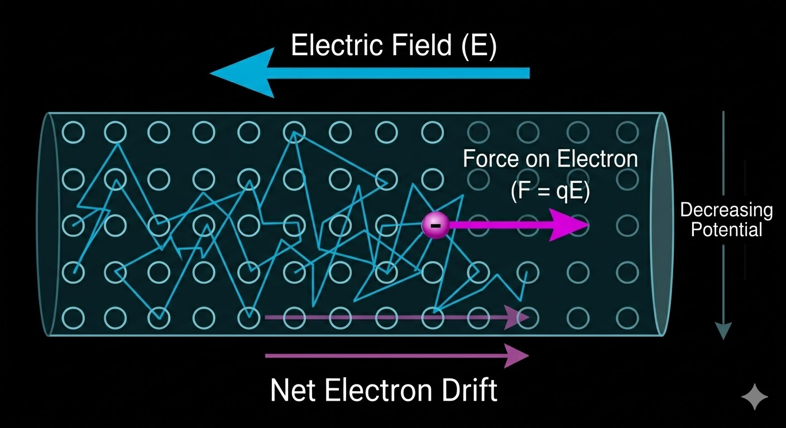

## Drift Velocity

This acceleration does not last long. The electron quickly crashes into a vibrating atom in the crystal lattice, losing its forward momentum, and the process starts over. 

The average steady speed the electrons achieve between these collisions is called the **drift velocity (vd)**:

vd = a * t

Substitute the acceleration (a) we found earlier:

vd = (q * E * t) / m

**Where:**
* **vd** > drift velocity (m/s)
* **t** > mean free time between collisions (seconds)

*Fun Fact: While the electric field propagates through a wire at nearly the speed of light, the actual electrons are moving incredibly slowly—often less than a millimeter per second!*

***

## Microscopic Ohm's Law

Now we look at the bulk flow of all these electrons. **Current density (J)** depends on the number of free electrons, their charge, and how fast they are drifting:

J = n * q * vd

Substitute our drift velocity equation into this:

J = (n * q^2 * t / m) * E

Look closely at the term in the parentheses `(n * q^2 * t / m)`. For a specific material at a specific temperature, this is a constant value. We call this constant the **conductivity**, represented by the Greek letter sigma (s). 

This gives us the microscopic version of Ohm's Law:

J = s * E

**Where:**
* **J** > current density (A/m2)
* **s** > conductivity (S/m)
* **E** > electric field (V/m)

***

## Macroscopic Ohm's Law (V = I * R)

To make this useful for engineering, we need to translate these microscopic vectors (J and E) into macroscopic circuit values (I and V) that we can actually measure with a multimeter.

For a standard wire of length **L** and cross-sectional area **A**:
* **E = V / L** (The electric field is the voltage drop across the wire's length)
* **J = I / A** (Current density is the total current divided by the area)

Substitute these into our microscopic equation (J = s * E):

I / A = s * (V / L)

Rearrange this to solve for Voltage (V):

V = I * (L / (s * A))

We define **Resistivity (p)** as the exact opposite of conductivity (p = 1 / s). 
We define **Resistance (R)** as how much a specific physical object restricts flow based on its material, length, and area:

R = p * (L / A)

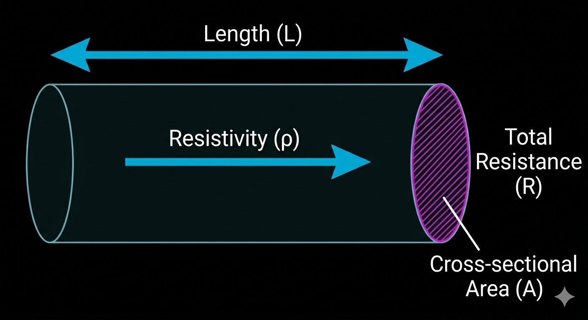

Substitute R back into our rearranged equation, and we arrive at the classic macroscopic Ohm's Law:

V = I * R

***

## Joule Heating (Power)

Remember those microscopic collisions from the Drude model? Every time an electron crashes into the lattice, it transfers kinetic energy. This microscopic friction manifests as macroscopic heat. 

The rate at which this energy is converted to heat is **Electrical Power (P)**:

P = V * I

Substitute Ohm's Law (V = I * R) into this to see the direct relationship with resistance:

P = I^2 * R

**Where:**
* **P** > power dissipated as heat (watts, W)
* **I** > current (amperes, A)
* **R** > resistance (ohms)

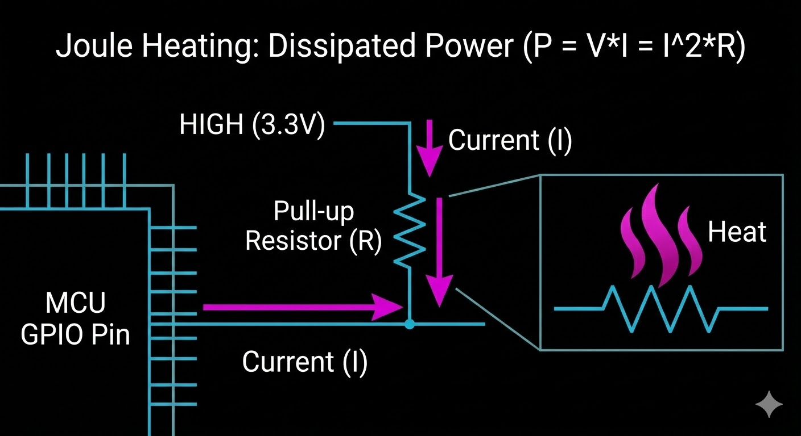

### Embedded Systems Connection

* **Trace Width:** High current (I) squared means massive heat generation. If a PCB trace's area (A) is too small, its resistance (R) goes up, causing the trace to melt. 
* **Pull-up Resistors:** We use resistors (often 4.7k or 10k ohms) on lines like I2C to limit the current. Without them, a logic LOW would create a short circuit, pulling massive current and burning out the microcontroller pin.
* **Thermal Throttling:** Processors monitor their own temperature. When switching millions of transistors, P = I^2 * R heating adds up quickly, forcing the system to slow down its clock speed to avoid physical damage.